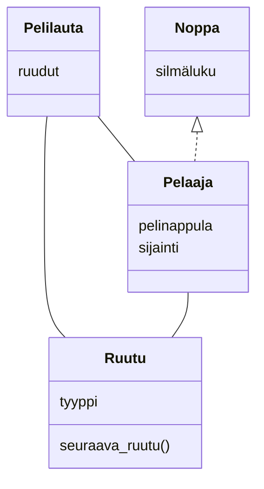

## Monopolin luokkakaavio

```mermaid
 classDiagram
      Pelilauta -- Pelaaja
      Pelilauta -- Ruutu
      Pelaaja -- Ruutu
      Noppa <|.. Pelaaja
      class Pelilauta{
        ruudut
      }
      class Pelaaja{
        pelinappula
        sijainti
      }
      class Ruutu{
        tyyppi
        seuraava_ruutu()
      }
      class Noppa{
        silmäluku
      }
```